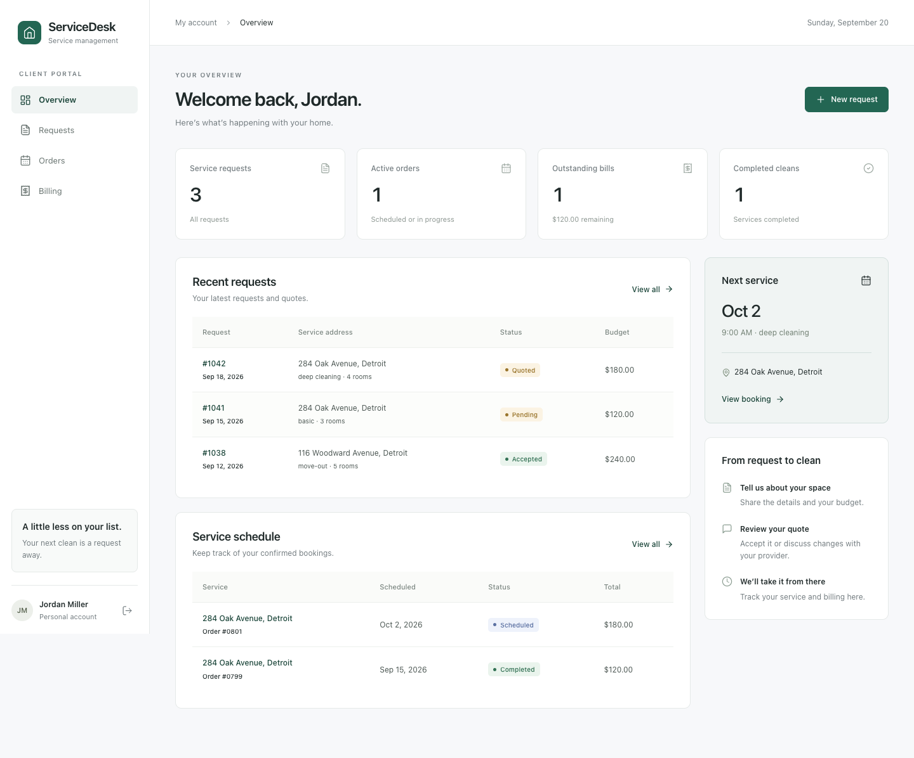
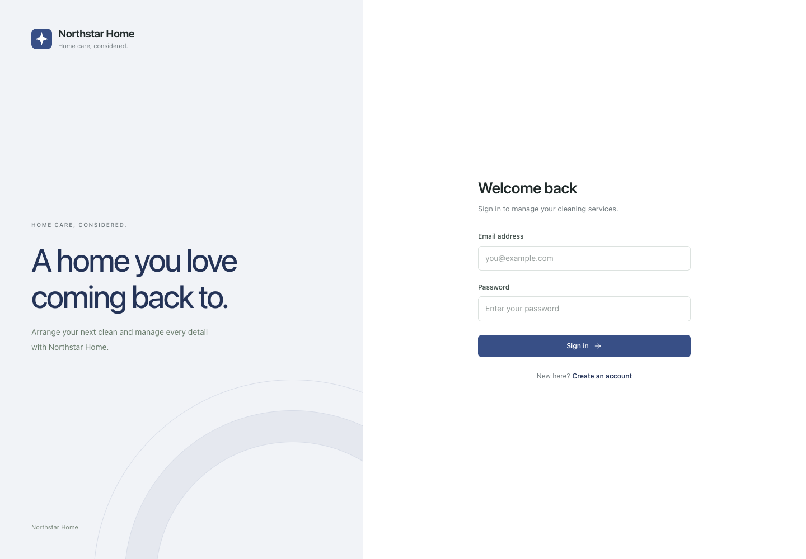

# ServiceDesk

A white-label application for managing cleaning services, from the first request through scheduling and billing. Each business can use its own name, logo, colors, and administrator account.

Clients can request a clean, share photos, review or negotiate quotes, and track their orders and bills. The administrator manages incoming requests, service schedules, billing revisions, and eight client and business reports.

Built with React 18, React Router, Express, and MySQL. Authentication uses JSON Web Tokens and bcrypt password hashing.



Client dashboard with sample data.

## Branding

Edit [frontend/public/branding.json](frontend/public/branding.json) to configure the business identity:

```json
{
  "name": "Your business",
  "tagline": "Home services",
  "accentColor": "#236653",
  "logoUrl": "/brand/logo.svg",
  "faviconUrl": "/brand/favicon.svg",
  "headline": "A clean home.\nA clearer day.",
  "description": "Book a service, review quotes, and manage your appointments."
}
```

Place logo and favicon files in `frontend/public/brand/`, or use HTTPS asset URLs. Leave either URL empty to use the default icon. Colors use six-digit hex values.

Branding loads when the application opens and controls the navigation, sign-in screen, page title, browser icon, and accent colors. After building, you can update the deployed `branding.json` and assets without rebuilding the JavaScript. Reload the page to see changes. Invalid or unavailable configuration falls back to ServiceDesk defaults.

Each deployment serves one business. Shared hosting for multiple businesses with isolated accounts and data is outside the current scope.



Example deployment with custom branding.

## Local setup

Requirements: Node.js 20 or newer, npm, and a running MySQL 8 server.

Install the dependencies and create the backend configuration:

```sh
git clone https://github.com/ysham123/DBFINAL.git
cd DBFINAL
npm run install-all
cp backend/.env.example backend/.env
```

Set the following values in `backend/.env`:

- `DB_HOST`, `DB_PORT`, `DB_USER`, `DB_PASSWORD`, and `DB_NAME`: your MySQL connection details.
- `ADMIN_EMAIL`: the email address reserved for the administrator.
- `ADMIN_FIRST_NAME` and `ADMIN_LAST_NAME`: the initial administrator's display name.
- `ADMIN_PASSWORD`: a password of at least 12 characters for the initial administrator account.
- `JWT_SECRET`: a random secret of at least 32 characters for signing session tokens.

Generate a signing secret locally:

```sh
node -e "console.log(require('node:crypto').randomBytes(32).toString('hex'))"
```

Initialize an empty database:

```sh
npm run setup
```

Setup creates the database, seven tables, and the administrator account. The configured MySQL user needs permission to create the database and tables. Setup stops if the database already contains tables; existing installations can skip this step.

Start the API:

```sh
npm run start-backend
```

In a second terminal, start the frontend:

```sh
npm run start-frontend
```

Open [localhost:3000](http://localhost:3000). Sign in with `ADMIN_EMAIL` and your configured administrator password, or create a client account through registration. Administrator pages are under `/admin`.

For an existing database, set `ADMIN_EMAIL` to the existing administrator's email, skip database setup, and sign in again. Changing this setting changes which account has administrator access; it does not rename or create an existing account. The existing schema and records remain compatible.

## Configuration

See [backend/.env.example](backend/.env.example) for the complete server configuration. Local environment files are excluded from version control.

The frontend uses `/api` by default. During development, API and upload requests are proxied to `http://localhost:5000`. For a separately hosted API, set `REACT_APP_API_URL` in `frontend/.env` to its full URL, including `/api`, and set the backend's `CLIENT_ORIGIN` to the frontend origin. Restart the development server or rebuild the frontend after changing its environment settings.

Service requests accept up to five JPG, PNG, or GIF images, with a default limit of 5 MB each. Uploads are stored in `backend/uploads`. A custom relative `UPLOAD_PATH` resolves from the backend directory.

## Build

```sh
npm --prefix frontend run build
npm run start-backend
```

The backend serves the compiled frontend, API, and uploaded files from the same origin. The configured database must be available when the server starts. Client and administrator routes support direct navigation and page refreshes.

## Verification

Run the API regression tests:

```sh
npm --prefix backend test
```

Tests cover authentication, authorization, input validation, quote acceptance, billing restrictions, upload cleanup, and connection failures. They use a database stub and do not require MySQL.

For a full installation check, follow the [manual workflow](SETUP_COMPLETE.md) against a running database. `GET /api/health` checks database connectivity and returns HTTP 503 when the database is unavailable.

For connection troubleshooting, `node check-xampp.js` checks the credentials in `backend/.env`. It supports both XAMPP and standalone MySQL servers.

## Application structure

- `frontend/src/components`: navigation, auth layout, dialogs, tables, and shared UI.
- `frontend/public/branding.json`: deployment branding, loaded at runtime.
- `frontend/src/pages`: client and admin workflows.
- `frontend/src/services/api.js`: API configuration and session-expiry handling.
- `backend/routes`: authentication, requests, quotes, orders, bills, and reports.
- `backend/middleware`: authentication, upload handling, and validation.
- `database/schema.sql`: schema for a fresh database.
- `sql.txt`: reference queries for the eight reports.

## Current scope

Billing records payments made outside the application; it does not process cards or transfer money. Uploaded photos are served through public asset URLs. Email notifications and password recovery are not implemented.

Administration is limited to the account configured by `ADMIN_EMAIL`.

Originally developed for CSC 6710 Database Systems.
